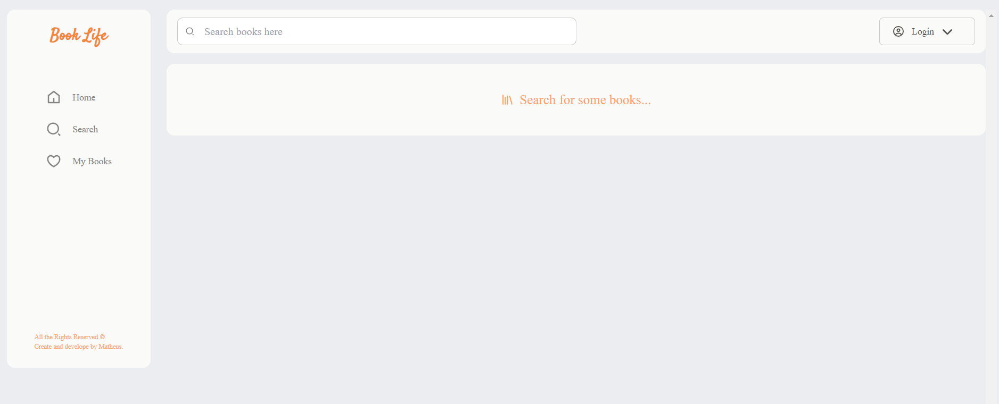
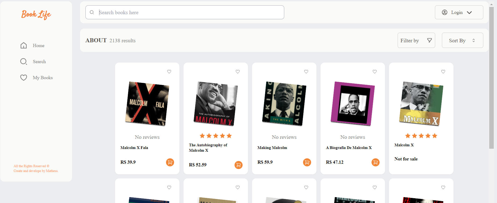

# Book Life

**Book Life** is a free website where you can search for books and bookmark your favorites books in your account.

## How to use:

When you enter the site, you must see this screen below:

You can search for any book in the main page or by using the search button in the sidebar.

Once you search for some book, you be able to see this screen:

You can also favorite the book that you like, but for this feature you need to create an account or log in to an existing account.

## 🔨Tools

The stacks I used in this project were:

**Frontend**

- JavaScript - Programming language
- React.Js - Library
- Tailwind - Stylesheet

**Backend**

- NodeJS
- Express - Framework
- MongoDB - Database

# 📌 Version

I used the Git for version control. To see the latest version.

# 📄 License

This project is licensed under the MIT License.

## Link project

click here: https://book-life.vercel.app/
